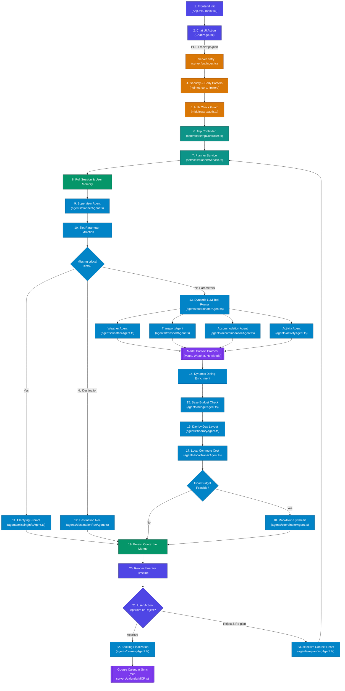

# Capstone Project: End-to-End Codebase Flow Guide

This document provides a highly detailed, step-by-step trace of how the codebase initializes, how data moves across different folders, and how the Multi-Agent AI Swarm coordinates complex tasks. You can share this document or use it as a reference script when presenting to your mentor.



---

## Part 1: Detailed File Separation (The Directories)

The codebase is logically separated into a **React Frontend (client)** and an **Express Backend (server)**. Below is the directory blueprint with exact filenames and descriptions:

### 🚀 1. The Client Directory (`d:\Presidio Capstone Project\client`)

*   **[`main.tsx`](file:///d:/Presidio%20Capstone%20Project/client/src/main.tsx)**: The entry point for React. Mounts the virtual DOM to the browser window.
*   **[`App.tsx`](file:///d:/Presidio%20Capstone%20Project/client/src/App.tsx)**: App wrapper. Sets up the React Router routes, manages global themes (dark/light), and triggers session rehydration on page refreshing.
*   **📁 Directory: `client/src/store` (State Management)**
    *   **[`authStore.ts`](file:///d:/Presidio%20Capstone%20Project/client/src/store/authStore.ts)**: Leverages Zustand to cache traveler tokens, profile data, and session status in-memory securely.
    *   **[`themeStore.ts`](file:///d:/Presidio%20Capstone%20Project/client/src/store/themeStore.ts)**: Toggles layout viewing styles between dark/light.
*   **📁 Directory: `client/src/pages` (Renders Routes)**
    *   **[`ChatPage.tsx`](file:///d:/Presidio%20Capstone%20Project/client/src/pages/ChatPage.tsx)**: The main interface. Houses the conversational console, the interactive itinerary canvas, and the plan details inspector.
    *   **[`MyTripsPage.tsx`](file:///d:/Presidio%20Capstone%20Project/client/src/pages/MyTripsPage.tsx)**: Traveler dashboard indexing current, confirmed, or draft travel itineraries.
    *   **[`LoginPage.tsx`](file:///d:/Presidio%20Capstone%20Project/client/src/pages/LoginPage.tsx)** / **[`RegisterPage.tsx`](file:///d:/Presidio%20Capstone%20Project/client/src/pages/RegisterPage.tsx)**: Standard credential handlers.
    *   **[`GoogleCallbackPage.tsx`](file:///d:/Presidio%20Capstone%20Project/client/src/pages/GoogleCallbackPage.tsx)**: Post-OAuth callback receiver that persists token codes and triggers calendar sync actions.
*   **📁 Directory: `client/src/components` (Reusable UI)**
    *   **[`chat/InspectorTab.tsx`](file:///d:/Presidio%20Capstone%20Project/client/src/components/chat/InspectorTab.tsx)**: Rendered panel tracking active hotel selection lists, transport schedules, and details of the current trip budget calculations. Gives users manual selection capabilities.
    *   **[`chat/ItineraryTimeline.tsx`](file:///d:/Presidio%20Capstone%20Project/client/src/components/chat/ItineraryTimeline.tsx)**: Interactively draws day-by-day itineraries with timeline checkpoints, local travel commutes, and pricing logs.
    *   **[`Navbar.tsx`](file:///d:/Presidio%20Capstone%20Project/client/src/components/Navbar.tsx)**: Displays the navigation menu, logo, and active authorization profile buttons.
*   **📁 Directory: `client/src/lib` (Network Hooks)**
    *   **[`axios.ts`](file:///d:/Presidio%20Capstone%20Project/client/src/lib/axios.ts)**: Configures default server URLs and axios interceptors ensuring `withCredentials` passes secure cookie validations.

---

### ⚙️ 2. The Server Directory (`d:\Presidio Capstone Project\server`)

*   **[`index.ts`](file:///d:/Presidio%20Capstone%20Project/server/src/index.ts)**: The primary Express runtime entry. Mounts core middlewares (security, ratelimiting, parses body payloads), connects MongoDB, and opens listener ports.
*   **📁 Directory: `server/src/config` (Database Handshakes)**
    *   **[`db.ts`](file:///d:/Presidio%20Capstone%20Project/server/src/config/db.ts)**: Sets up the connection pool to MongoDB Atlas utilizing Mongoose.
*   **📁 Directory: `server/src/middleware` (Request Filters)**
    *   **[`auth.ts`](file:///d:/Presidio%20Capstone%20Project/server/src/middleware/auth.ts)**: Re-validates request HTTP Headers. Decodes JWT tokens to verify access permissions before calling endpoint routes.
    *   **[`requestId.ts`](file:///d:/Presidio%20Capstone%20Project/server/src/middleware/requestId.ts)**: Attaches a tracking UUID to requests to track operations through Winston logs.
    *   **[`errorHandler.ts`](file:///d:/Presidio%20Capstone%20Project/server/src/middleware/errorHandler.ts)**: Catch-all error router formatting server crash dumps into standardized JSON envelopes.
*   **📁 Directory: `server/src/routes` (HTTP Route Maps)**
    *   **[`tripRoutes.ts`](file:///d:/Presidio%20Capstone%20Project/server/src/routes/tripRoutes.ts)**: Registers routes for planning, selecting transport/hotels, approvals, cancellations, and calendar syncing.
    *   **[`authRoutes.ts`](file:///d:/Presidio%20Capstone%20Project/server/src/routes/authRoutes.ts)**: Registers routes for registration, standard login, JWT refreshing, and Google OAuth callbacks.
*   **📁 Directory: `server/src/controllers` (Express Request Logic)**
    *   **[`tripController.ts`](file:///d:/Presidio%20Capstone%20Project/server/src/controllers/tripController.ts)**: Direct controller mapping incoming trip requests to services. Sanitizes user strings against command injections, implements date safety thresholds, and handles custom manual overrides.
    *   **[`authController.ts`](file:///d:/Presidio%20Capstone%20Project/server/src/controllers/authController.ts)**: Handles session logic (creating JWTs, setting HttpOnly cookies, registering user items).
*   **📁 Directory: `server/src/services` (Main Business Engine)**
    *   **[`plannerService.ts`](file:///d:/Presidio%20Capstone%20Project/server/src/services/plannerService.ts)**: Orchestrates database reads (fetching user preferences and history) and delegates planning processing to the AI swarm.
*   **📁 Directory: `server/src/models` (Database Schemas)**
    *   **[`Trip.ts`](file:///d:/Presidio%20Capstone%20Project/server/src/models/Trip.ts)**: Document definition outlining trip status, raw requirements, weather, transport, hotels, itinerary layout, and booking receipts.
    *   **[`User.ts`](file:///d:/Presidio%20Capstone%20Project/server/src/models/User.ts)**: Document definition capturing credentials, Google tokens, and personalized traveler memory fields.
*   **📁 Directory: `server/src/agents` (The LangChain Agent Swarm)**
    *   **[`plannerAgent.ts`](file:///d:/Presidio%20Capstone%20Project/server/src/agents/plannerAgent.ts)**: The Swarm Supervisor. Extracts parameters, clamps input boundaries, and routes prompts to tool targets.
    *   **[`coordinatorAgent.ts`](file:///d:/Presidio%20Capstone%20Project/server/src/agents/coordinatorAgent.ts)**: Runs child retrieval agents concurrently and compiles final plan summaries.
    *   **[`missingInfoAgent.ts`](file:///d:/Presidio%20Capstone%20Project/server/src/agents/missingInfoAgent.ts)**: Generates polite questions asking the traveler for missing files or fields.
    *   **[`destinationRecAgent.ts`](file:///d:/Presidio%20Capstone%20Project/server/src/agents/destinationRecAgent.ts)**: Matches user profile memory to recommend top travel destinations.
    *   **[`weatherAgent.ts`](file:///d:/Presidio%20Capstone%20Project/server/src/agents/weatherAgent.ts)**: Looks up meteorology charts for destination zones.
    *   **[`transportAgent.ts`](file:///d:/Presidio%20Capstone%20Project/server/src/agents/transportAgent.ts)**: Retreives travel route options.
    *   **[`accommodationAgent.ts`](file:///d:/Presidio%20Capstone%20Project/server/src/agents/accommodationAgent.ts)**: Collects hotel pricing details.
    *   **[`activityAgent.ts`](file:///d:/Presidio%20Capstone%20Project/server/src/agents/activityAgent.ts)**: Finds dining/attractions.
    *   **[`budgetAgent.ts`](file:///d:/Presidio%20Capstone%20Project/server/src/agents/budgetAgent.ts)**: Calculates base budgets.
    *   **[`itineraryAgent.ts`](file:///d:/Presidio%20Capstone%20Project/server/src/agents/itineraryAgent.ts)**: Draws day-by-day JSON schedule grids.
    *   **[`localTransitAgent.ts`](file:///d:/Presidio%20Capstone%20Project/server/src/agents/localTransitAgent.ts)**: Connects Maps API to calculate hotel-attraction routes.
    *   **[`bookingAgent.ts`](file:///d:/Presidio%20Capstone%20Project/server/src/agents/bookingAgent.ts)**: Finalizes bookings (mocked).
    *   **[`replanningAgent.ts`](file:///d:/Presidio%20Capstone%20Project/server/src/agents/replanningAgent.ts)**: Resets specific context variables on rejection loops.
*   **📁 Directory: `server/src/mcp-servers` (API Integration Adapters)**
    *   **[`mapsMCP.ts`](file:///d:/Presidio%20Capstone%20Project/server/src/mcp-servers/mapsMCP.ts)**: MCP wrapper connecting to Maps APIs for geo-searching attractions and calculating transit times.
    *   **[`calendarMCP.ts`](file:///d:/Presidio%20Capstone%20Project/server/src/mcp-servers/calendarMCP.ts)**: Integrates OAuth credentials to write itinerary events to Google Calendar.
    *   **[`weatherMCP.ts`](file:///d:/Presidio%20Capstone%20Project/server/src/mcp-servers/weatherMCP.ts)**: Connects OpenWeather to query forecasts.
*   **📁 Directory: `server/src/utils` (Helper Packages)**
    *   **[`llm.ts`](file:///d:/Presidio%20Capstone%20Project/server/src/utils/llm.ts)**: The primary LLM Factory. Initializes the ChatGroq model binding with key rotations, API failovers, fallback loops, and XML thinking strip filters.
    *   **[`inputSanitizer.ts`](file:///d:/Presidio%20Capstone%20Project/server/src/utils/inputSanitizer.ts)**: Custom validators that block script/prompt injections and clamp traveler thresholds.
    *   **[`logger.ts`](file:///d:/Presidio%20Capstone%20Project/server/src/utils/logger.ts)**: Configures logs via Winston.
*   **📁 Directory: `server/src/prompts` (System Prompts)**
    *   **[`index.ts`](file:///d:/Presidio%20Capstone%20Project/server/src/prompts/index.ts)**: Aggregates system instruction templates for each agent in the swarm.

---

## Part 2: Step-by-Step Execution Flow

Below is the step-by-step process of how data traverses the codebase when a traveler drafts and confirms a trip plan.

### Step 1: Frontend Bootstrap & Session Refresh
1.  The traveler opens the app. React bootstrap mounts in **[`main.tsx`](file:///d:/Presidio%20Capstone%20Project/client/src/main.tsx)**.
2.  **[`App.tsx`](file:///d:/Presidio%20Capstone%20Project/client/src/App.tsx)** triggers a `useEffect` on startup to execute a silent token refresh:
    *   Client calls `/api/auth/refresh` targeting **[`authRoutes.ts`](file:///d:/Presidio%20Capstone%20Project/server/src/routes/authRoutes.ts)**.
    *   Handled by `refresh` in **[`authController.ts`](file:///d:/Presidio%20Capstone%20Project/server/src/controllers/authController.ts)**, which reads cookies and sends a fresh `accessToken` & user profile.
    *   Session hydrates state in **[`authStore.ts`](file:///d:/Presidio%20Capstone%20Project/client/src/store/authStore.ts)** before rendering pages (preventing flash-login redirections).

### Step 2: The User Asks to Plan a Trip
1.  The traveler navigates to `/dashboard/plan` (**[`ChatPage.tsx`](file:///d:/Presidio%20Capstone%20Project/client/src/pages/ChatPage.tsx)**) and types a message:
    *   *Example: "Plan a 3-day trip to Goa from Mumbai for 2 people with a budget of ₹15,000 next month."*
2.  `ChatPage.tsx` packages the message payload alongside any existing `tripId` (if editing an existing trip) and sends a POST request to the server:
    ```http
    POST http://localhost:5000/api/trips/plan
    Authorization: Bearer <JWT_ACCESS_TOKEN>
    Content-Type: application/json
    
    {
      "message": "Plan a 3-day trip to Goa...",
      "tripId": "optional-session-uuid"
    }
    ```

### Step 3: Express Server Entry & Middleware Processing
1.  The request hits the Express server in **[`index.ts`](file:///d:/Presidio%20Capstone%20Project/server/src/index.ts)**.
2.  It runs through global middlewares:
    *   **Helmet (`helmet()`)**: Restructures HTTP headers for security.
    *   **CORS**: Ensures only requests from the React client domain are allowed.
    *   **Rate Limiter**: Restricts traffic to 100 requests per 15 mins per IP.
    *   **JSON Limit**: Clamps JSON payloads strictly to `10kb` to thwart body-bloat DoS vectors.
    *   **Cookie Parser**: Reads client cookies for session tracking.
    *   **Request ID (`requestId.ts`)**: Attaches a unique string to the request (e.g. `req.requestId = "uuid"`).
    *   **Morgan Logging**: Records request metadata via Winston.
3.  The request matches router pathname `/api/trips` and gets forwarded to **[`tripRoutes.ts`](file:///d:/Presidio%20Capstone%20Project/server/src/routes/tripRoutes.ts)**.

### Step 4: Authentication Security Gate
1.  Before any router logic matches, the request must pass `authenticate` middleware in **[`auth.ts`](file:///d:/Presidio%20Capstone%20Project/server/src/middleware/auth.ts)**:
    *   It checks the `Authorization` header for format `Bearer <token>`.
    *   The JWT token signature and expiration date are verified using `process.env.JWT_ACCESS_SECRET`.
    *   If correct, it maps the decoded token contents to `req.user` (`userId` and logical `role`).
    *   Calls `next()` to proceed.

### Step 5: Trip Controller & Sanitization
1.  The route translates to POST `/plan` matching `createOrUpdateTrip` in **[`tripController.ts`](file:///d:/Presidio%20Capstone%20Project/server/src/controllers/tripController.ts)**.
2.  The controller executes sanity checks:
    *   Rejects empty inputs.
    *   **Prompt Injection Scan**: Passes input to `isMessageSafe(message)` in **[`inputSanitizer.ts`](file:///d:/Presidio%20Capstone%20Project/server/src/utils/inputSanitizer.ts)**. If disallowed keywords or script patterns are detected, it aborts instantly with code 400.
    *   If a `tripId` was specified to alter an active plan, it queries MongoDB. If the trip's status is already `CONFIRMED`, it blocks the edit (confirmed trips cannot be altered).
3.  It calls the core service layer:
    ```typescript
    const result = await planTrip(message, userId, tripId, req.requestId);
    ```

### Step 6: Service Layer Memory & Context Retrieval
1.  The request moves into `planTrip` in **[`plannerService.ts`](file:///d:/Presidio%20Capstone%20Project/server/src/services/plannerService.ts)**.
2.  It pulls personalization context:
    *   Fetches the user document from MongoDB (**[`User.ts`](file:///d:/Presidio%20Capstone%20Project/server/src/models/User.ts)**). Extracts `user.longTermMemory` containing previous traveler constraints (past destinations, preferences).
    *   If `existingTripId` resides in parameters, it loads the trip context from MongoDB (**[`Trip.ts`](file:///d:/Presidio%20Capstone%20Project/server/src/models/Trip.ts)**). Otherwise, it initializes a clean `TripContext` structure (marked as `DRAFT`).
3.  It appends the new traveler chat prompt into the `conversationHistory` array and calls the mastermind supervisor:
    ```typescript
    const result = await runPlannerAgent(userMessage, context, longTermMemory);
    ```

### Step 7: The AI Swarm Supervisor (Planner Agent)
1.  `runPlannerAgent` in **[`plannerAgent.ts`](file:///d:/Presidio%20Capstone%20Project/server/src/agents/plannerAgent.ts)** takes over execution:
    *   **Slot Extraction**: A fast inference run on LLM (using `llama-3.1-8b-instant` on Groq, configured in **[`utils/llm.ts`](file:///d:/Presidio%20Capstone%20Project/server/src/utils/llm.ts)**) reads the conversation log and extracts slots: `destination`, `origin`, `start_date`, `end_date`, `travelers`, `budget_inr`, `interests`.
    *   **Programmatic Clamping**:
        *   Travelers target volume is strictly bounded to range `1 - 10`.
        *   Budget ceiling is strictly clamped to range `₹1,000 - ₹1,000,000`.
        *   Dates are processed in `validateTripDates`. If the start-date points to past calendars or ends before starting, it wipes dates and prompts the user for correction.
2.  **Supervisor Tool Routing**:
    *   The Supervisor model is initialized with tools bound using LangChain: `validate_trip_inputs`, `recommend_destination`, and `orchestrate_and_generate_trip_plan`.
    *   *Case A: Critical parameters missing* $\rightarrow$ invokes `validate_trip_inputs` $\rightarrow$ delegates to **[`missingInfoAgent.ts`](file:///d:/Presidio%20Capstone%20Project/server/src/agents/missingInfoAgent.ts)** to output a polite clarifying request (e.g. asking for dates or travelers).
    *   *Case B: Destination missing* $\rightarrow$ invokes `recommend_destination` $\rightarrow$ delegates to **[`destinationRecAgent.ts`](file:///d:/Presidio%20Capstone%20Project/server/src/agents/destinationRecAgent.ts)** (mines user interests, matches them with long-term memory, suggests 3 recommendations, and picks the top match).
    *   *Case C: Inputs valid* $\rightarrow$ invokes `orchestrate_and_generate_trip_plan`.

### Step 8: Multi-Agent Parallel Fetching
If the Supervisor selects plan orchestration, it executes `runParallelAgents` in **[`coordinatorAgent.ts`](file:///d:/Presidio%20Capstone%20Project/server/src/agents/coordinatorAgent.ts)**:
1.  **Parallel Execution**: It fires concurrent API retrieval calls utilizing Promise tools:
    *   **Weather Agent** (**[`weatherAgent.ts`](file:///d:/Presidio%20Capstone%20Project/server/src/agents/weatherAgent.ts)**): Feeds location and dates into OpenWeather API via **[`weatherMCP.ts`](file:///d:/Presidio%20Capstone%20Project/server/src/mcp-servers/weatherMCP.ts)**.
    *   **Transport Agent** (**[`transportAgent.ts`](file:///d:/Presidio%20Capstone%20Project/server/src/agents/transportAgent.ts)**): Leverages transportation tools.
    *   **Accommodation Agent** (**[`accommodationAgent.ts`](file:///d:/Presidio%20Capstone%20Project/server/src/agents/accommodationAgent.ts)**): Queries lodging options matching budget tier.
    *   **Activity Agent** (**[`activityAgent.ts`](file:///d:/Presidio%20Capstone%20Project/server/src/agents/activityAgent.ts)**): Suggests local points of interest and dining spots.
2.  **Dynamic Dining Enrichment**: The coordinator checks if a hotel choice exists. If present, it makes an extra MCP geolocation request to search for dining spots near the hotel.

### Step 9: Budget Validation (Phase 1)
1.  The coordinator feeds context to `runBudgetAgent` in **[`budgetAgent.ts`](file:///d:/Presidio%20Capstone%20Project/server/src/agents/budgetAgent.ts)**.
2.  It aggregates base costs (lodging, transport, food, sights):
    *   If total base costs surpass the user's budget ceiling, it marks the plan infeasible, generates 4-5 alternative adjustments (e.g. *shorten trip, reduce travelers, or switch to budget hotel*), halts progress, and prompts the user to choose.

### Step 10: Scheduling & Local Transit Calculations
1.  If the base budget is feasible, the scheduler calls `runItineraryAgent` in **[`itineraryAgent.ts`](file:///d:/Presidio%20Capstone%20Project/server/src/agents/itineraryAgent.ts)**.
    *   It structures a day-by-day JSON schedule mapping weather conditions, dining schedules, and sight-seeing times.
2.  **Local Commutes**: The context passes to **[`localTransitAgent.ts`](file:///d:/Presidio%20Capstone%20Project/server/src/agents/localTransitAgent.ts)**.
    *   It measures distance/duration from the selected hotel to each daily point of interest in parallel via Google Maps/Geoapify routing through **[`mapsMCP.ts`](file:///d:/Presidio%20Capstone%20Project/server/src/mcp-servers/mapsMCP.ts)**.
    *   Translates distances to commutes: walking (free), auto (wheels/fare calculations), or cab (booking rates).
    *   Adds local transit costs, applies a safety cap, and re-runs the budget checks.
    *   If the budget is STILL feasible, it proceeds. If exceeded, it halts and gives alternatives.

### Step 11: Summary Synthesis & Client Return
1.  The final details are merged. The coordinator executes `synthesizeTripPlan` in **[`coordinatorAgent.ts`](file:///d:/Presidio%20Capstone%20Project/server/src/agents/coordinatorAgent.ts)**:
    *   LLM formats a structured summary utilizing markdown presentation styles.
2.  **[`plannerService.ts`](file:///d:/Presidio%20Capstone%20Project/server/src/services/plannerService.ts)** grabs the result context:
    *   Saves the entire context in MongoDB (**[`Trip.ts`](file:///d:/Presidio%20Capstone%20Project/server/src/models/Trip.ts)**) under `sessionId`, marked as `PLANNED`.
    *   Updates the user's `longTermMemory` in MongoDB (**[`User.ts`](file:///d:/Presidio%20Capstone%20Project/server/src/models/User.ts)**) with the preferred destination.
3.  The controller receives the plan payload and responds to the frontend.

---

## Part 3: Human-in-the-Loop Booking & Modifications

Once the client parses the returned plan, the interactive dashboard splits into two flows:

### Flow A: The User Rejects & Re-plans
1.  If the user chooses a budget alternative or types a modification request, **[`ChatPage.tsx`](file:///d:/Presidio%20Capstone%20Project/client/src/pages/ChatPage.tsx)** fires a POST to `/api/trips/:tripId/reject`.
2.  The backend calls `runReplanningAgent` in **[`replanningAgent.ts`](file:///d:/Presidio%20Capstone%20Project/server/src/agents/replanningAgent.ts)**:
    *   Keeps user credentials, origin, dates, and destination.
    *   **Wipes only the stale elements** (itinerary, budget, flight arrays, local transport).
    *   Saves changes in database $\rightarrow$ loops back into `planTrip(...)` with an enriched prompt to generate a new itinerary.

### Flow B: The User Approves & Confirms Booking
1.  The user clicks "Confirm & Book" $\rightarrow$ client posts to `/api/trips/:tripId/approve`.
2.  **[`tripController.ts`](file:///d:/Presidio%20Capstone%20Project/server/src/controllers/tripController.ts)** ensures details are correct, then triggers `runBookingAgent(...)` in **[`bookingAgent.ts`](file:///d:/Presidio%20Capstone%20Project/server/src/agents/bookingAgent.ts)**:
    *   Secures booking reservations (mocked values).
    *   Flips trip database status to `CONFIRMED`.
3.  **Google Calendar Sync**:
    *   If calendar credentials are linked, the backend triggers `createCalendarEvent(...)` in **[`calendarMCP.ts`](file:///d:/Presidio%20Capstone%20Project/server/src/mcp-servers/calendarMCP.ts)**, creating calendar invitations specifying dates and booking codes, which automatically sync to user's Google Calendar.
    *   If not linked, the client prompts the traveler to connect via Google OAuth, which redirects back to `/dashboard/plan?google_auth=success` to sync.
4.  All systems complete. The traveler has a locked, confirmed travel schedule.
