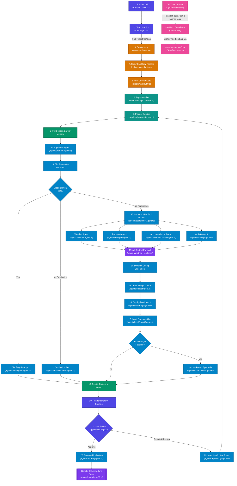

# Capstone Project: End-to-End Codebase Flow Guide

This document provides a highly detailed, step-by-step trace of how the codebase initializes, how data moves across different folders, and how the Multi-Agent AI Swarm coordinates complex tasks. It also catalogs the Docker setups, GitHub Actions automation pipelines, and Terraform AWS infrastructures. Share this document or use it as a reference script when presenting to your mentor.



---

## Part 1: Detailed File Separation (The Directories)

The codebase is logically separated into a **React Frontend (client)**, an **Express Backend (server)**, a **DevOps Pipeline folder**, and an **Infrastructure Configuration** suite.

### 🚀 1. The Client Directory (`d:\Presidio Capstone Project\client`)

*   **[`main.tsx`](file:///d:/Presidio%20Capstone%20Project/client/src/main.tsx)**: React DOM mounting.
*   **[`App.tsx`](file:///d:/Presidio%20Capstone%20Project/client/src/App.tsx)**: React Router routes mapping and session hydration on page refresh.
*   **📁 Directory: `client/src/store` (State)**
    *   **[`authStore.ts`](file:///d:/Presidio%20Capstone%20Project/client/src/store/authStore.ts)**: Caches user payloads and access tokens via Zustand.
    *   **[`themeStore.ts`](file:///d:/Presidio%20Capstone%20Project/client/src/store/themeStore.ts)**: Configures dark/light themes.
*   📁 **Directory: `client/src/pages` (Renders Routes)**
    *   **[`ChatPage.tsx`](file:///d:/Presidio%20Capstone%20Project/client/src/pages/ChatPage.tsx)**: Interactive travel console, itinerary canvas, and budget breakdown inspector.
    *   **[`MyTripsPage.tsx`](file:///d:/Presidio%20Capstone%20Project/client/src/pages/MyTripsPage.tsx)**: Index dashboard caching all draft and booked trips.
*   📁 **Directory: `client/src/components` (UI Elements)**
    *   **[`chat/InspectorTab.tsx`](file:///d:/Presidio%20Capstone%20Project/client/src/components/chat/InspectorTab.tsx)**: Sidebar panel detailing hotel, transport, and budget selections.
    *   **[`chat/ItineraryTimeline.tsx`](file:///d:/Presidio%20Capstone%20Project/client/src/components/chat/ItineraryTimeline.tsx)**: Detailed daily scheduling card timeline.

---

### ⚙️ 2. The Server Directory (`d:\Presidio Capstone Project\server`)

*   **[`index.ts`](file:///d:/Presidio%20Capstone%20Project/server/src/index.ts)**: The primary Express runtime bootstrap. Configures Helmet, CORS, log pipelines, and mounts route controllers.
*   📁 **Directory: `server/src/middleware` (Request Guards)**
    *   **[`auth.ts`](file:///d:/Presidio%20Capstone%20Project/server/src/middleware/auth.ts)**: Validates incoming request JWT headers to protect traveler endpoints.
    *   **[`requestId.ts`](file:///d:/Presidio%20Capstone%20Project/server/src/middleware/requestId.ts)**: Attaches a unique string to the request to trace operations.
    *   **[`errorHandler.ts`](file:///d:/Presidio%20Capstone%20Project/server/src/middleware/errorHandler.ts)**: Standardizes error responses into clean JSON envelopes.
*   📁 **Directory: `server/src/controllers` & `services` (Core Logic)**
    *   **[`tripController.ts`](file:///d:/Presidio%20Capstone%20Project/server/src/controllers/tripController.ts)**: Direct request controller sanitizing inputs and handling manual overrides.
    *   **[`plannerService.ts`](file:///d:/Presidio%20Capstone%20Project/server/src/services/plannerService.ts)**: Coordinates MongoDB queries with the agent swarm.
*   📁 **Directory: `server/src/agents` (LangChain Multi-Agent Swarm)**
    *   **[`plannerAgent.ts`](file:///d:/Presidio%20Capstone%20Project/server/src/agents/plannerAgent.ts)**: The Supervisor that extracts parameters and routes queries.
    *   **[`coordinatorAgent.ts`](file:///d:/Presidio%20Capstone%20Project/server/src/agents/coordinatorAgent.ts)**: Executes child agents concurrently and compiles markdown summaries.
    *   **[`budgetAgent.ts`](file:///d:/Presidio%20Capstone%20Project/server/src/agents/budgetAgent.ts)**: Validates cost thresholds and provides alternatives.
    *   **[`itineraryAgent.ts`](file:///d:/Presidio%20Capstone%20Project/server/src/agents/itineraryAgent.ts)**: Formats day-by-day JSON schedule grids.
    *   **[`localTransitAgent.ts`](file:///d:/Presidio%20Capstone%20Project/server/src/agents/localTransitAgent.ts)**: Connects Maps API to calculate hotel-to-attraction commutes.
    *   **[`replanningAgent.ts`](file:///d:/Presidio%20Capstone%20Project/server/src/agents/replanningAgent.ts)**: Resets specific context variables on rejection loops.
*   📁 **Directory: `server/src/mcp-servers` (Adapters)**
    *   **[`mapsMCP.ts`](file:///d:/Presidio%20Capstone%20Project/server/src/mcp-servers/mapsMCP.ts)**: Resolves Geolocation searches and transit estimates.
    *   **[`calendarMCP.ts`](file:///d:/Presidio%20Capstone%20Project/server/src/mcp-servers/calendarMCP.ts)**: Writes itinerary events to Google Calendar.
    *   **[`weatherMCP.ts`](file:///d:/Presidio%20Capstone%20Project/server/src/mcp-servers/weatherMCP.ts)**: Fetches open-source meteorology updates.

---

### 🐳 3. Docker Containerization Configuration

Container configurations standardize environment baselines, speeding up builds and preparing the app for cloud deployment:

*   **[`client/Dockerfile`](file:///d:/Presidio%20Capstone%20Project/client/Dockerfile)**: Multi-stage React containerization file.
    *   *Stage 1 (Builder)*: Pulls a lightweight Node Alpine image, runs `npm ci` (using package-lock hashes for exact caching), and runs Vite's build CLI to output code assets into `/app/dist/`.
    *   *Stage 2 (Production)*: Copies the compiled bundle into a fresh `nginx:1.27-alpine` container and loads a custom config (**[`client/nginx.conf`](file:///d:/Presidio%20Capstone%20Project/client/nginx.conf)**) to handle SPA client-side route fallbacks.
*   **[`server/Dockerfile`](file:///d:/Presidio%20Capstone%20Project/server/Dockerfile)**: Multi-stage NodeJS node compile file.
    *   *Stage 1 (Builder)*: Installs all elements (including devDependencies like TypeScript compiler) and compiles TypeScript source files into JavaScript under `/dist/`.
    *   *Stage 2 (Runtime)*: Re-installs *only production dependencies* using `npm ci --only=production`, pulls in compiler JS products, drops privileges to standard user `node` for security, and opens port `5000`.
*   **[`docker-compose.prod.yml`](file:///d:/Presidio%20Capstone%20Project/docker-compose.prod.yml)**: The orchestration blueprint deployed on the EC2 host.
    *   Defines **`api`**: Spins up the backend node container with healthcheck routines and mapping local port `5000`.
    *   Defines **`redis`**: Spins up a `redis:7-alpine` cache, limits memory footprint, sets automatic Least Recently Used (LRU) evictions, and logs container outputs inside a localized volume layer.

---

### 🐙 4. Continuous Integration & Deployment (GitHub Actions)

Stored in **`.github/workflows/`**, this coordinates tests and automatically deploys changes when code is merged to the `main` branch.

*   **[`ci.yml`](file:///d:/Presidio%20Capstone%20Project/.github/workflows/ci.yml)**: Continuous Integration. Runs on every Pull Request to `main`:
    1.  **TypeScript Verification**: Checks both `/client` and `/server` against compiler exceptions using `tsc --noEmit`.
    2.  **Vulnerability Scans**: Executes `npm audit --audit-level=high` to detect high/critical package issues.
    3.  **Vite Build Check**: Compiles the React distribution bundle to ensure it compiles without errors.
    4.  **Dry-run Docker Compilation**: Builds both client and server containers to check for errors before changes are merged.
*   **[`cd.yml`](file:///d:/Presidio%20Capstone%20Project/.github/workflows/cd.yml)**: Continuous Deployment. Runs automatically on merging commits into the `main` branch:
    1.  **Docker Hub Publish**: Logins to Docker Hub using secrets, uses Buildx to package the Express image under both standard `:latest` tags and Git SHA tags, and pushes them.
    2.  **S3 Assets Upload**: Compiles the React static bundle (injecting safe CloudFront SSL endpoints), syncs elements to S3 (`aws s3 sync`), and invalidates CDN cache layers (`aws cloudfront create-invalidation`) so visitors get the latest bundle immediately.
    3.  **Dynamic Firewalls Management**: Fetches the runner IP and dynamically edits EC2 inbound security group protocols to whitelist SSH access.
    4.  **SSH Orchestration**: Logs into AWS EC2 using a PEM secret key, writes an automated SSM script (`fetch_secrets.sh`) to poll decrypted variables from AWS SSM Parameter store at runtime, pulls the latest Docker Hub image, restarts services using Docker Compose, prunes unused images, and closes SSH firewall blocks.
    5.  **Status Check Verification**: Hits the server's `/health` endpoint to verify the deployment was successful.

---

### 🌐 5. Terraform Infrastructure as Code

Stored in **`infrastructure/`**, this folder allows developers to spin up or tear down the entire AWS infrastructure using declarative configurations.

*   **[`main.tf`](file:///d:/Presidio%20Capstone%20Project/infrastructure/main.tf)**: Provisons the cloud infrastructure:
    *   **VPC, Subnets, and IGW**: Provisions the network topology.
    *   **S3 Bucket**: Hosts the static React frontend files.
    *   **CloudFront CDN Distribution**: Serves S3 elements over HTTPS. Resolves browser security limitations by routing API paths (`/api/*`) straight to the EC2 API server.
    *   **EC2 Instance (Amazon Linux 2)**: Runs the Express server and Redis cache.
    *   **Security Groups**: Blocks public database ports and keeps only CloudFront ports open (restricting SSH access to dynamic whitelisted runners).
    *   **IAM Roles & Profiles**: Attaches SSM access permissions to the EC2 server to fetch secret variables.
*   **[`variables.tf`](file:///d:/Presidio%20Capstone%20Project/infrastructure/variables.tf)**: Defines configurations like AWS region (`ap-south-1`), instance types (`t3.medium`), and project names.
*   **[`outputs.tf`](file:///d:/Presidio%20Capstone%20Project/infrastructure/outputs.tf)**: Outputs the CloudFront distribution domain name and EC2 Host IP after provisioning.
*   **[`user_data.sh`](file:///d:/Presidio%20Capstone%20Project/infrastructure/user_data.sh)**: A bootstrap shell script executed when the EC2 instance starts up. It installs Git, Docker, and Docker Compose, logs into Docker Hub, sets up local folders, and starts the container orchestration process.

---

## Part 2: Step-by-Step Execution Flow

Below is the step-by-step process of how data traverses the codebase when a traveler drafts and confirms a trip plan.

### Step 1: Frontend Bootstrap & Session Refresh
1.  The traveler opens the app. React bootstrap mounts in **[`main.tsx`](file:///d:/Presidio%20Capstone%20Project/client/src/main.tsx)**.
2.  **[`App.tsx`](file:///d:/Presidio%20Capstone%20Project/client/src/App.tsx)** triggers a `useEffect` on startup to execute a silent token refresh:
    *   Client calls `/api/auth/refresh` targeting **[`authRoutes.ts`](file:///d:/Presidio%20Capstone%20Project/server/src/routes/authRoutes.ts)**.
    *   Handled by `refresh` in **[`authController.ts`](file:///d:/Presidio%20Capstone%20Project/server/src/controllers/authController.ts)**, which reads cookies and sends a fresh `accessToken` & user profile.
    *   Session hydrates state in **[`authStore.ts`](file:///d:/Presidio%20Capstone%20Project/client/src/store/authStore.ts)** before rendering pages (preventing flash-login redirections).

### Step 2: The User Asks to Plan a Trip
1.  The traveler navigates to `/dashboard/plan` (**[`ChatPage.tsx`](file:///d:/Presidio%20Capstone%20Project/client/src/pages/ChatPage.tsx)**) and types a message:
    *   *Example: "Plan a 3-day trip to Goa from Mumbai for 2 people with a budget of ₹15,000 next month."*
2.  `ChatPage.tsx` packages the message payload alongside any existing `tripId` (if editing an existing trip) and sends a POST request to the server:
    ```http
    POST http://localhost:5000/api/trips/plan
    Authorization: Bearer <JWT_ACCESS_TOKEN>
    Content-Type: application/json
    
    {
      "message": "Plan a 3-day trip to Goa...",
      "tripId": "optional-session-uuid"
    }
    ```

### Step 3: Express Server Entry & Middleware Processing
1.  The request hits the Express server in **[`index.ts`](file:///d:/Presidio%20Capstone%20Project/server/src/index.ts)**.
2.  It runs through global middlewares:
    *   **Helmet (`helmet()`)**: Restructures HTTP headers for security.
    *   **CORS**: Ensures only requests from the React client domain are allowed.
    *   **Rate Limiter**: Restricts traffic to 100 requests per 15 mins per IP.
    *   **JSON Limit**: Clamps JSON payloads strictly to `10kb` to thwart body-bloat DoS vectors.
    *   **Cookie Parser**: Reads client cookies for session tracking.
    *   **Request ID (`requestId.ts`)**: Attaches a unique string to the request (e.g. `req.requestId = "uuid"`).
    *   **Morgan Logging**: Records request metadata via Winston.
3.  The request matches router pathname `/api/trips` and gets forwarded to **[`tripRoutes.ts`](file:///d:/Presidio%20Capstone%20Project/server/src/routes/tripRoutes.ts)**.

### Step 4: Authentication Security Gate
1.  Before any router logic matches, the request must pass `authenticate` middleware in **[`auth.ts`](file:///d:/Presidio%20Capstone%20Project/server/src/middleware/auth.ts)**:
    *   It checks the `Authorization` header for format `Bearer <token>`.
    *   The JWT token signature and expiration date are verified using `process.env.JWT_ACCESS_SECRET`.
    *   If correct, it maps the decoded token contents to `req.user` (`userId` and logical `role`).
    *   Calls `next()` to proceed.

### Step 5: Trip Controller & Sanitization
1.  The route translates to POST `/plan` matching `createOrUpdateTrip` in **[`tripController.ts`](file:///d:/Presidio%20Capstone%20Project/server/src/controllers/tripController.ts)**.
2.  The controller executes sanity checks:
    *   Rejects empty inputs.
    *   **Prompt Injection Scan**: Passes input to `isMessageSafe(message)` in **[`inputSanitizer.ts`](file:///d:/Presidio%20Capstone%20Project/server/src/utils/inputSanitizer.ts)**. If disallowed keywords or script patterns are detected, it aborts instantly with code 400.
    *   If a `tripId` was specified to alter an active plan, it queries MongoDB. If the trip's status is already `CONFIRMED`, it blocks the edit (confirmed trips cannot be altered).
3.  It calls the core service layer:
    ```typescript
    const result = await planTrip(message, userId, tripId, req.requestId);
    ```

### Step 6: Service Layer Memory & Context Retrieval
1.  The request moves into `planTrip` in **[`plannerService.ts`](file:///d:/Presidio%20Capstone%20Project/server/src/services/plannerService.ts)**.
2.  It pulls personalization context:
    *   Fetches the user document from MongoDB (**[`User.ts`](file:///d:/Presidio%20Capstone%20Project/server/src/models/User.ts)**). Extracts `user.longTermMemory` containing previous traveler constraints (past destinations, preferences).
    *   If `existingTripId` resides in parameters, it loads the trip context from MongoDB (**[`Trip.ts`](file:///d:/Presidio%20Capstone%20Project/server/src/models/Trip.ts)**). Otherwise, it initializes a clean `TripContext` structure (marked as `DRAFT`).
3.  It appends the new traveler chat prompt into the `conversationHistory` array and calls the mastermind supervisor:
    ```typescript
    const result = await runPlannerAgent(userMessage, context, longTermMemory);
    ```

### Step 7: The AI Swarm Supervisor (Planner Agent)
1.  `runPlannerAgent` in **[`plannerAgent.ts`](file:///d:/Presidio%20Capstone%20Project/server/src/agents/plannerAgent.ts)** takes over execution:
    *   **Slot Extraction**: A fast inference run on LLM (using `llama-3.1-8b-instant` on Groq, configured in **[`utils/llm.ts`](file:///d:/Presidio%20Capstone%20Project/server/src/utils/llm.ts)**) reads the conversation log and extracts slots: `destination`, `origin`, `start_date`, `end_date`, `travelers`, `budget_inr`, `interests`.
    *   **Programmatic Clamping**:
        *   Travelers target volume is strictly bounded to range `1 - 10`.
        *   Budget ceiling is strictly clamped to range `₹1,000 - ₹1,000,000`.
        *   Dates are processed in `validateTripDates`. If the start-date points to past calendars or ends before starting, it wipes dates and prompts the user for correction.
2.  **Supervisor Tool Routing**:
    *   The Supervisor model is initialized with tools bound using LangChain: `validate_trip_inputs`, `recommend_destination`, and `orchestrate_and_generate_trip_plan`.
    *   *Case A: Critical parameters missing* $\rightarrow$ invokes `validate_trip_inputs` $\rightarrow$ delegates to **[`missingInfoAgent.ts`](file:///d:/Presidio%20Capstone%20Project/server/src/agents/missingInfoAgent.ts)** to output a polite clarifying request (e.g. asking for dates or travelers).
    *   *Case B: Destination missing* $\rightarrow$ invokes `recommend_destination` $\rightarrow$ delegates to **[`destinationRecAgent.ts`](file:///d:/Presidio%20Capstone%20Project/server/src/agents/destinationRecAgent.ts)** (mines user interests, matches them with long-term memory, suggests 3 recommendations, and picks the top match).
    *   *Case C: Inputs valid* $\rightarrow$ invokes `orchestrate_and_generate_trip_plan`.

### Step 8: Multi-Agent Parallel Fetching
If the Supervisor selects plan orchestration, it executes `runParallelAgents` in **[`coordinatorAgent.ts`](file:///d:/Presidio%20Capstone%20Project/server/src/agents/coordinatorAgent.ts)**:
1.  **Parallel Execution**: It fires concurrent API retrieval calls utilizing Promise tools:
    *   **Weather Agent** (**[`weatherAgent.ts`](file:///d:/Presidio%20Capstone%20Project/server/src/agents/weatherAgent.ts)**): Feeds location and dates into OpenWeather API via **[`weatherMCP.ts`](file:///d:/Presidio%20Capstone%20Project/server/src/mcp-servers/weatherMCP.ts)**.
    *   **Transport Agent** (**[`transportAgent.ts`](file:///d:/Presidio%20Capstone%20Project/server/src/agents/transportAgent.ts)**): Leverages transportation tools.
    *   **Accommodation Agent** (**[`accommodationAgent.ts`](file:///d:/Presidio%20Capstone%20Project/server/src/agents/accommodationAgent.ts)**): Queries lodging options matching budget tier.
    *   **Activity Agent** (**[`activityAgent.ts`](file:///d:/Presidio%20Capstone%20Project/server/src/agents/activityAgent.ts)**): Suggests local points of interest and dining spots.
2.  **Dynamic Dining Enrichment**: The coordinator checks if a hotel choice exists. If present, it makes an extra MCP geolocation request to search for dining spots near the hotel.

### Step 9: Budget Validation (Phase 1)
1.  The coordinator feeds context to `runBudgetAgent` in **[`budgetAgent.ts`](file:///d:/Presidio%20Capstone%20Project/server/src/agents/budgetAgent.ts)**.
2.  It aggregates base costs (lodging, transport, food, sights):
    *   If total base costs surpass the user's budget ceiling, it marks the plan infeasible, generates 4-5 alternative adjustments (e.g. *shorten trip, reduce travelers, or switch to budget hotel*), halts progress, and prompts the user to choose.

### Step 10: Scheduling & Local Transit Calculations
1.  If the base budget is feasible, the scheduler calls `runItineraryAgent` in **[`itineraryAgent.ts`](file:///d:/Presidio%20Capstone%20Project/server/src/agents/itineraryAgent.ts)**.
    *   It structures a day-by-day JSON schedule mapping weather conditions, dining schedules, and sight-seeing times.
2.  **Local Commutes**: The context passes to **[`localTransitAgent.ts`](file:///d:/Presidio%20Capstone%20Project/server/src/agents/localTransitAgent.ts)**.
    *   It measures distance/duration from the selected hotel to each daily point of interest in parallel via Google Maps/Geoapify routing through **[`mapsMCP.ts`](file:///d:/Presidio%20Capstone%20Project/server/src/mcp-servers/mapsMCP.ts)**.
    *   Translates distances to commutes: walking (free), auto (wheels/fare calculations), or cab (booking rates).
    *   Adds local transit costs, applies a safety cap, and re-runs the budget checks.
    *   If the budget is STILL feasible, it proceeds. If exceeded, it halts and gives alternatives.

### Step 11: Summary Synthesis & Client Return
1.  The final details are merged. The coordinator executes `synthesizeTripPlan` in **[`coordinatorAgent.ts`](file:///d:/Presidio%20Capstone%20Project/server/src/agents/coordinatorAgent.ts)**:
    *   LLM formats a structured summary utilizing markdown presentation styles.
2.  **[`plannerService.ts`](file:///d:/Presidio%20Capstone%20Project/server/src/services/plannerService.ts)** grabs the result context:
    *   Saves the entire context in MongoDB (**[`Trip.ts`](file:///d:/Presidio%20Capstone%20Project/server/src/models/Trip.ts)**) under `sessionId`, marked as `PLANNED`.
    *   Updates the user's `longTermMemory` in MongoDB (**[`User.ts`](file:///d:/Presidio%20Capstone%20Project/server/src/models/User.ts)**) with the preferred destination.
3.  The controller receives the plan payload and responds to the frontend.

---

## Part 3: Human-in-the-Loop Booking & Modifications

Once the client parses the returned plan, the interactive dashboard splits into two flows:

### Flow A: The User Rejects & Re-plans
1.  If the user chooses a budget alternative or types a modification request, **[`ChatPage.tsx`](file:///d:/Presidio%20Capstone%20Project/client/src/pages/ChatPage.tsx)** fires a POST to `/api/trips/:tripId/reject`.
2.  The backend calls `runReplanningAgent` in **[`replanningAgent.ts`](file:///d:/Presidio%20Capstone%20Project/server/src/agents/replanningAgent.ts)**:
    *   Keeps user credentials, origin, dates, and destination.
    *   **Wipes only the stale elements** (itinerary, budget, flight arrays, local transport).
    *   Saves changes in database $\rightarrow$ loops back into `planTrip(...)` with an enriched prompt to generate a new itinerary.

### Flow B: The User Approves & Confirms Booking
1.  The user clicks "Confirm & Book" $\rightarrow$ client posts to `/api/trips/:tripId/approve`.
2.  **[`tripController.ts`](file:///d:/Presidio%20Capstone%20Project/server/src/controllers/tripController.ts)** ensures details are correct, then triggers `runBookingAgent(...)` in **[`bookingAgent.ts`](file:///d:/Presidio%20Capstone%20Project/server/src/agents/bookingAgent.ts)**:
    *   Secures booking reservations (mocked values).
    *   Flips trip database status to `CONFIRMED`.
3.  **Google Calendar Sync**:
    *   If calendar credentials are linked, the backend triggers `createCalendarEvent(...)` in **[`calendarMCP.ts`](file:///d:/Presidio%20Capstone%20Project/server/src/mcp-servers/calendarMCP.ts)**, creating calendar invitations specifying dates and booking codes, which automatically sync to user's Google Calendar.
    *   If not linked, the client prompts the traveler to connect via Google OAuth, which redirects back to `/dashboard/plan?google_auth=success` to sync.
4.  All systems complete. The traveler has a locked, confirmed travel schedule.
